## Demo 1: SageMaker Data Wrangler 

* **Pre-requisites:**
    * We need to ensure dataset (loan default prediction) for ML is uploaded to a data source. 
    * Data source can be any one of the following options:
        * S3
        * Athena
        * RedShift
        * SnowFlake
* **Importing datasets from a data source (S3) to Data Wrangler**
    * Initialize SageMaker Data Wrangler via SageMaker Studio UI.
    
    * Takes a few minutes to load.
    
    * Once Data Wrangler is loaded, you should be able to see it under running instances and apps as shown below.
    
    * Next, git clone the no-code-low-code [repository](https://github.com/arunprsh/no-code-low-code) to SageMaker Studio notebook.
    * Start with [explore-dataset.ipynb](https://github.com/arunprsh/no-code-low-code/blob/main/finserv/tabular/loan-default-prediction/explore-data.ipynb) SageMaker Studio notebook.
        * Explore the dataset locally. 
        * Upload the datasets (CSV files) to an S3 location for consumption by SageMaker Data Wrangler later.
        * Copy the S3 URLs of the loans part files to your clipboard. We will use these URLs later to import these part files into Data Wrangler and join them.
    * Once Data Wrangler is up and running, you can see the following data flow interface with options for import, creating data flows and export as shown below.
    
    * Make sure to rename the untitled.flow to your preference (for e.g., join.flow)
    * Paste the S3 URL for the loans-part-1.csv file into the search box below.
    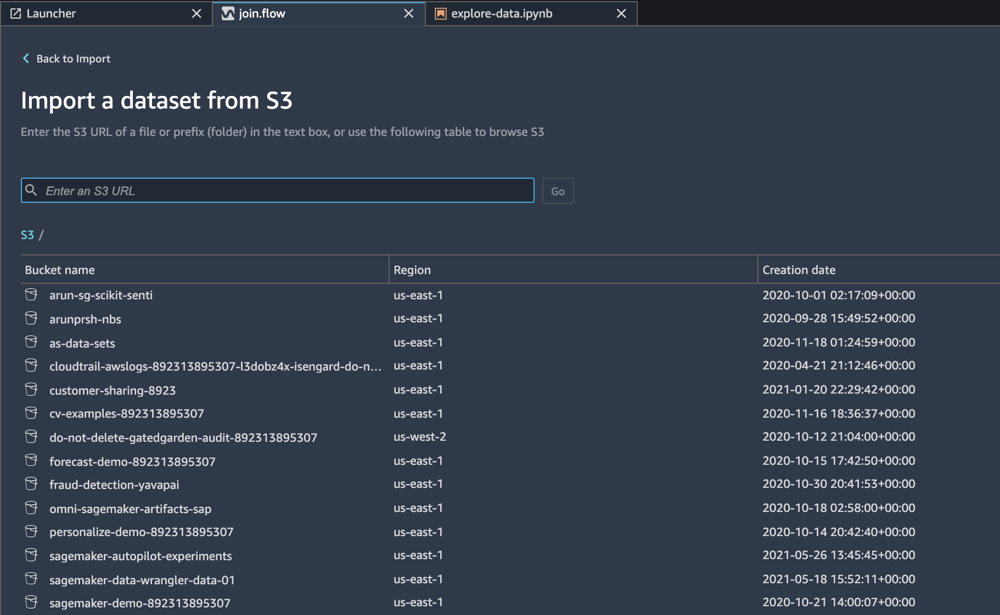
    * Paste the copied s3 URL of the loans-part-1.csv file into the search field as shown below and hit go.
    
    * Select the CSV file from the drop down results. On the right pane, make sure sampling is enabled and COMMA is chosen as the delimiter. Hit *import* to import this dataset to Data Wrangler. *Note:* You can also see a preview of the dataset at the bottom half as shown below.
    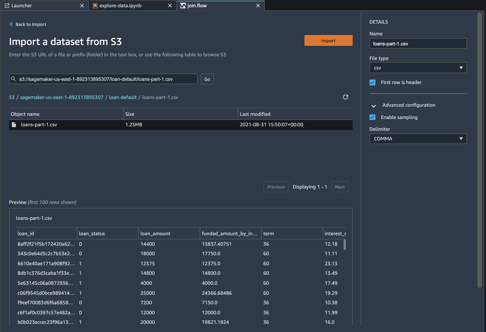
    * Once the dataset is imported, the Data flow interface looks as shown below.
    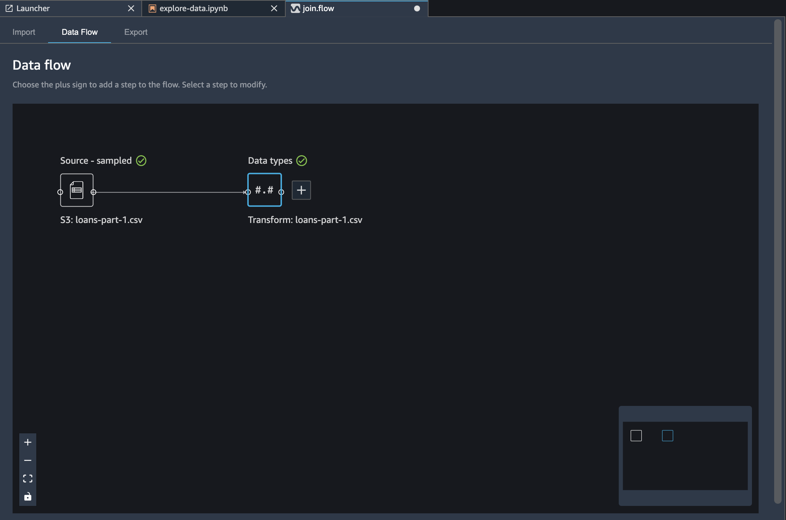
* Since currently you are in the data flow tab, hit the import tab (left of data flow tab) as seen in the above image. 
* Import the second part file (loans-part-2.csv) following the same set of instructions as noted previously.
    
* *Joining datasets*
    * Given, we have imported both the part CSV files in the previous steps. Let us walk through on how to join these CSV files based on a common unique identifier column. 
    * Click on either part-1 or part-2 file transform block as show in the image below:
        * Here, we have selected part-2 transform block and hit Join.
    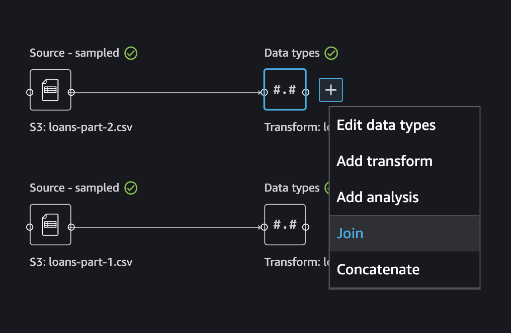
    * Select the other part file transform block and it automatically maps (converges) both the files into a Join preview as shown below.
    * *Note*: Files can also be concatenated similar to join operations. 
    * Hit configure.
    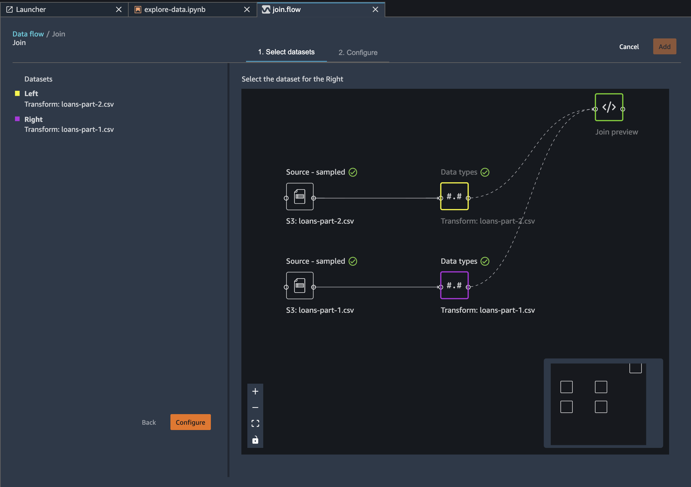
    * Here, choose a name for the resulting join file and choose the type of join and columns on to join.
    
    * Hit Apply. You can see a preview of the Joined dataset as shown in the image below.
    
    * Hit *Add* at the upper right corner to add this Join transform to the original data flow.
    * At the end of this step, the data flow looks as shown below.
    
    * Let’s see now how to add a simple transform using Data Wrangler to drop the redundant ID columns after the JOIN operation we did previously.
    * Select on the loans.csv block and click the + icon - under which click on Add transform.
    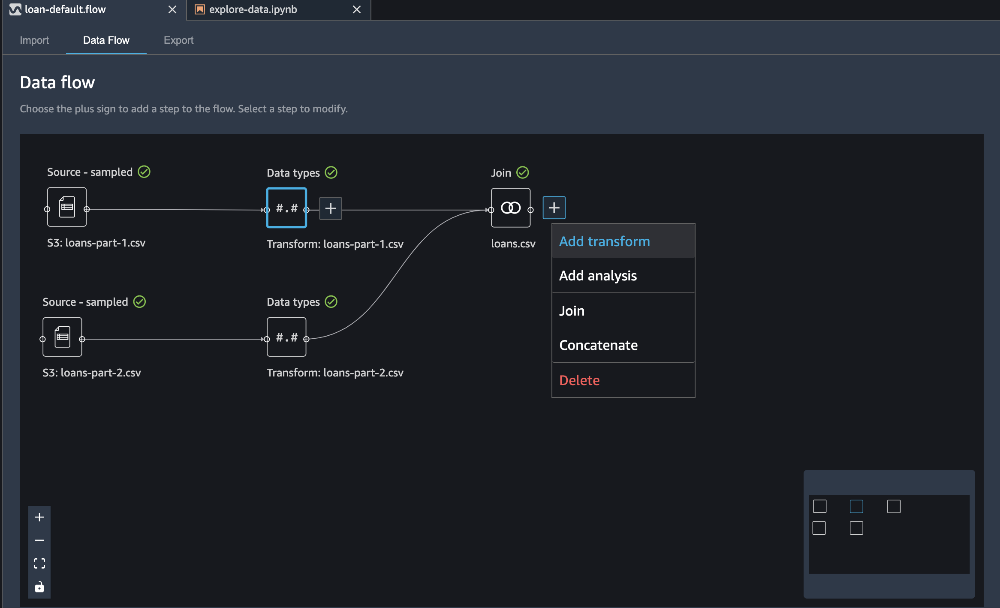
    * This takes us to the Data Wrangler transformations interface where there are over 300+ transformations you can apply to your dataset. For now, let us apply the manage columns transform to drop the id columns (id_0 and id_1).
    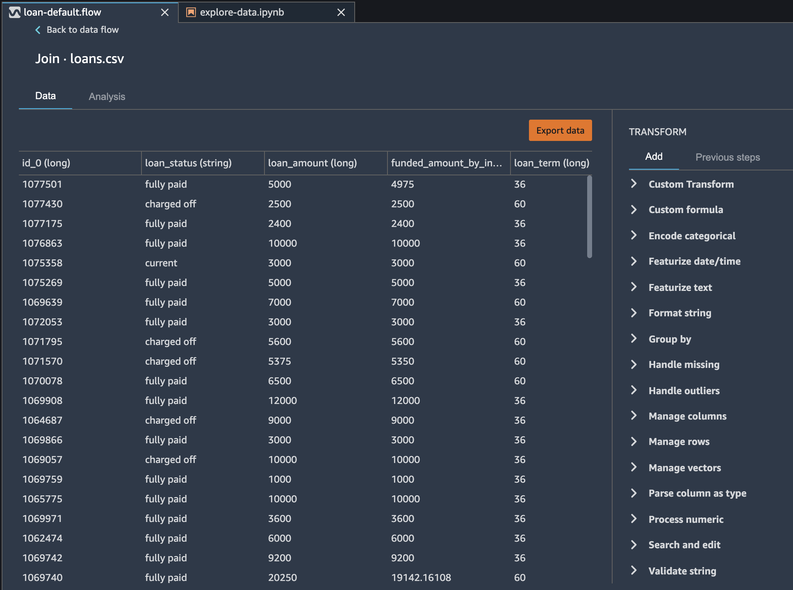
    * Select the manage columns drop down on the right pane and choose drop column and pick the column you want to drop as shown in the image below:
    
    * Hit preview first and then add.
    * Repeat the step for column id_1.
    * Now hit back to data flow as shown in the image below:
    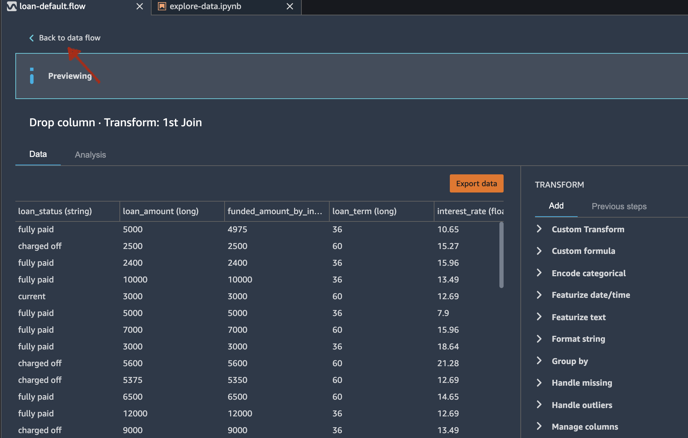
    * You should now be able to see the 2 transforms (dropping the two ID columns) as shown below in the Data Flow interface.
    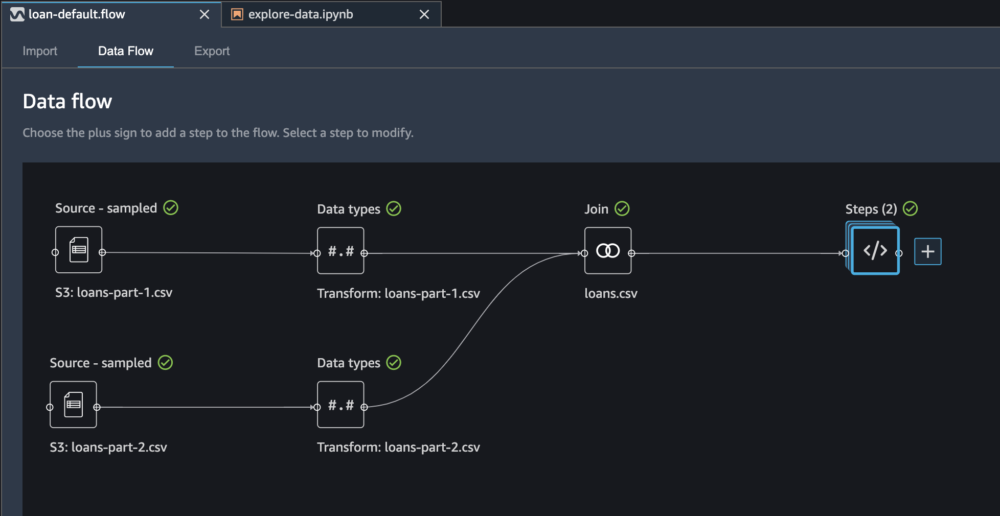
    * With this step, we have our joined dataset for loan default prediction ready to be explored and feature engineered which we will cover in the next steps.
* **Exploratory Data Analysis:**
    * Let’s start with a simple analysis to look into the descriptive statistics of our joined dataset.
    * Click the + symbol and choose Add analysis.
    
    * The analysis interface looks as shown below. There are 7 different types of analysis that can be performed. Let us choose Table Summary first to get some descriptive statistics about the data.
    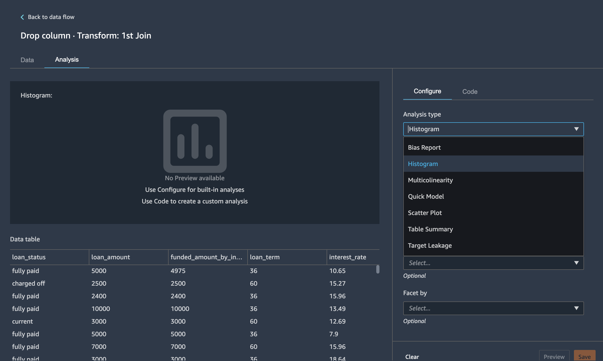
    * Once Table Summary is chosen, give your analysis a name; let’s call it Descriptive Statistics and hit preview. The summary is shown as seen in the picture below. Save the analysis.
    
    * Once the analysis is saved. The analysis is attached to a dashboard as shown below:
    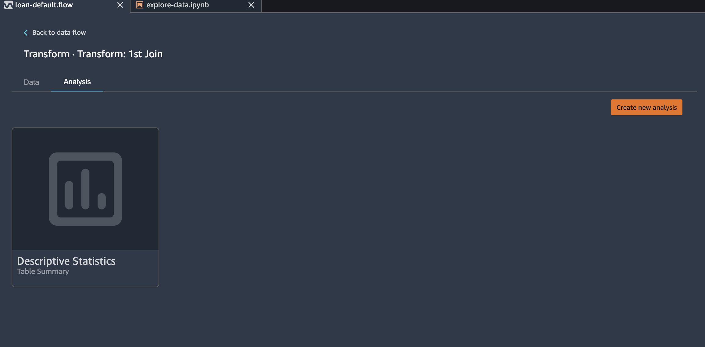
* **Visualization:**
    * Now, let us click the Create new analysis button to start creating some visualizations on the data. 
        * You can either pick the list of visualizations that come pre-installed for you in Data Wrangler or bring in your own custom visualization using Altair.
        * Altair is a declarative statistical visualization library for Python and you can write your own analysis/ visualization code as shown below. 
        
    * To create a visualization using options provided by default, let us choose *histogram* as the analysis type and fill in the details as shown in the image below. Hit Preview and Save the visualization to the analysis dashboard.
    
    * After saving the visualization, the analysis dashboard should look like the image shown below.
    
* *Quick Model:*
    * Given, we now know how to create an analysis now, let us create a new analysis to train a quick model that will let us know how well our raw feature columns are ready for training an effective machine learning model for classification (loan default prediction)
    * Hit Create new analysis and choose Quick Model for analysis type and loan_status for Label. As you can see, the quick model was able to train a model with an f1 score of 0.75 on test set. 
    * The quick model also shows the feature attribution (importance).
    
    * At the end of this analysis, the dashboard will look as shown below:
    
* *Feature Engineering (Feature Transformations)*
    * As a next step, let us start creating a few transformations to kick start the feature engineering process. Data Wrangler comes pre-baked with over 300 transformations which you can easily apply to your raw feature columns. As part of this demo, let us apply a few transformations for numeric, categorical and a text column.
    * Click *Back to data flow*
    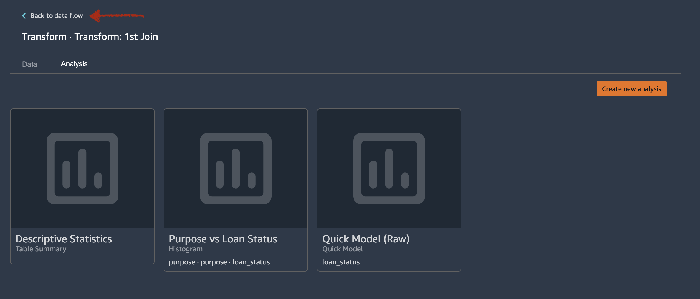
    * Click + and choose Add transform as shown below.
    
    * For numeric columns, you can add a scaling transform as shown below. Here we are scaling the interest rate column using a Min-max scaler provided by Data Wrangler. We can similarly scale other numeric columns. 
    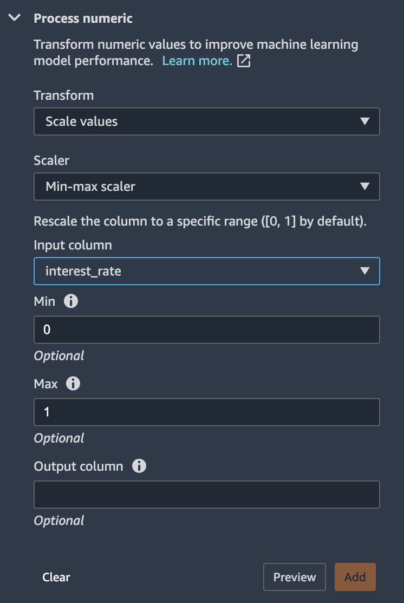
    * You can pick various other scalers depending on your use case if needed.
    
    * Next, let us see how we can transform a categorical feature column using Data Wrangler. 
    * For encoding categorical columns, Choose  *Encode Categorical* under the list of transformations and apply one-hot encode on the *purpose* column. 
    * You can also choose ordinal encoding if the categorical column is weighted.
    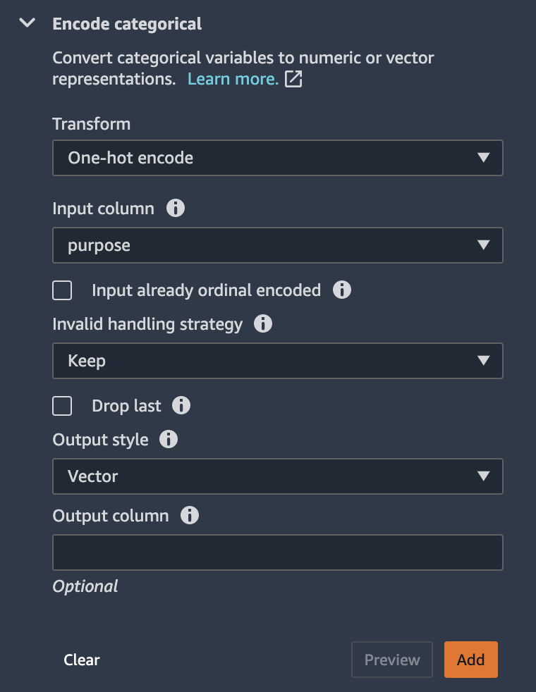
    * Next, we will see how to apply transformations on textual features. 
    * Column employer_title is a textual feature column in our dataset. We can vectorize this column by applying the count vectorizer and a standard tokenizer as shown in the image below. You can also bring in your own tokenizer if you wish.  Data Wrangler provided vectorizer is a tf-idf based vectorizer which lets you change and set attributes like max vocabulary size, min term frequency, min document frequency etc.
    
    * So far, we have seen how to transform different types of feature columns (numeric, categorical and text) using Data Wrangler’s pre-baked transformations. There are over 300+ transformations you can choose from + you can also bring in your own custom transformations (as shown below).
    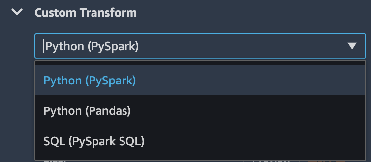
    * Given, we have applied 3 transformations: one for numeric, one for categorical and one for text, our dat flow interface should look like the image shown below.
    
    * Now, as a next step, let us try adding an analysis (quick model) on the transformed model to see if it improved the performance or changed the feature attribution ranking.
* *Evaluate feature transformations by re-building a Quick Model to track changes to feature attribution*
    * Click on the + symbol and choose Add analysis. Under analysis type, choose Quick Model and preview the results as shown in the image below.
    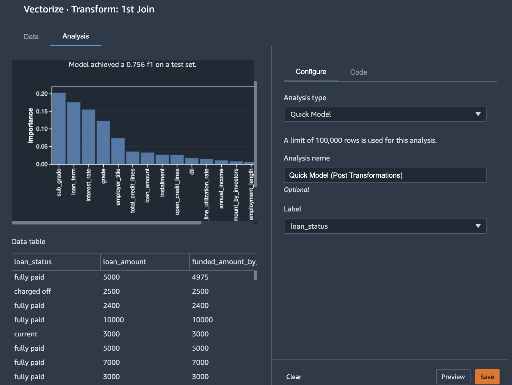

    * As you can see, we did not have any change to the f-score. But, we do see minor changes to the feature attribution ranking.
    * The more transformations we apply, the bigger these results can vary.
    * As a bonus exercise, we recommend you to try and apply transformations on all feature columns wherever necessary to improve the performance of the quick model. Quick model is a fast and easy analysis you can do to track changes to feature attribution and performance of the model.
    * In the next step, let us see how to export the transformed dataset to an S3 location. We will use this exported dataset with SageMaker Autopilot to automatically further enhance the feature engineering + try, train and tune multiple models and choose an optimal model.
* *Export transformed features to S3 (will be consumed by SageMaker Autopilot)*
    * To export the transformed dataset, first click on the + symbol and choose Add transform
    * This takes you to the data transform interface, here, click on the Export button as pointed out by the screen shot below.
    
    * Click Export data, choose the S3 location where you want to save the transformed dataset. 
    
    * Click Export data again. Within a few minutes, you should see the data being exported successfully as shown below. Follow the S3 uri to get to the part CSV file generated by Data Wrangler with all the applied transformations.
    
    
* *Other ways to export the transformations and analysis*
    * The loan-default.flow file that we created initially captures all of the transformations, joins and analysis. 
    * In a way, this file allows us to capture and persist every step of our feature engineering journey into a static file.
    * The flow file can then be used to re-create the analysis and feature engineering steps via Data Wrangler. All you need to do is import the flow file to SageMaker Studio and click on it.
    * We saw previously, how to export transformed dataset into S3. Additionally, we can also export the analysis and transformations in many other formats.
    * To start exporting, click on the export tab which is right of the Data flow tab we are used to by now.
    
    * Once in, you can choose until where you want to export the data preparation flow. E.g., we can just export the join output or export all the way from importing part files till that last block where we applied data transformations.
    * In the below image, we are selecting all the blocks (entire flow). Once selected, click the Export step in the top right corner of the interface.
    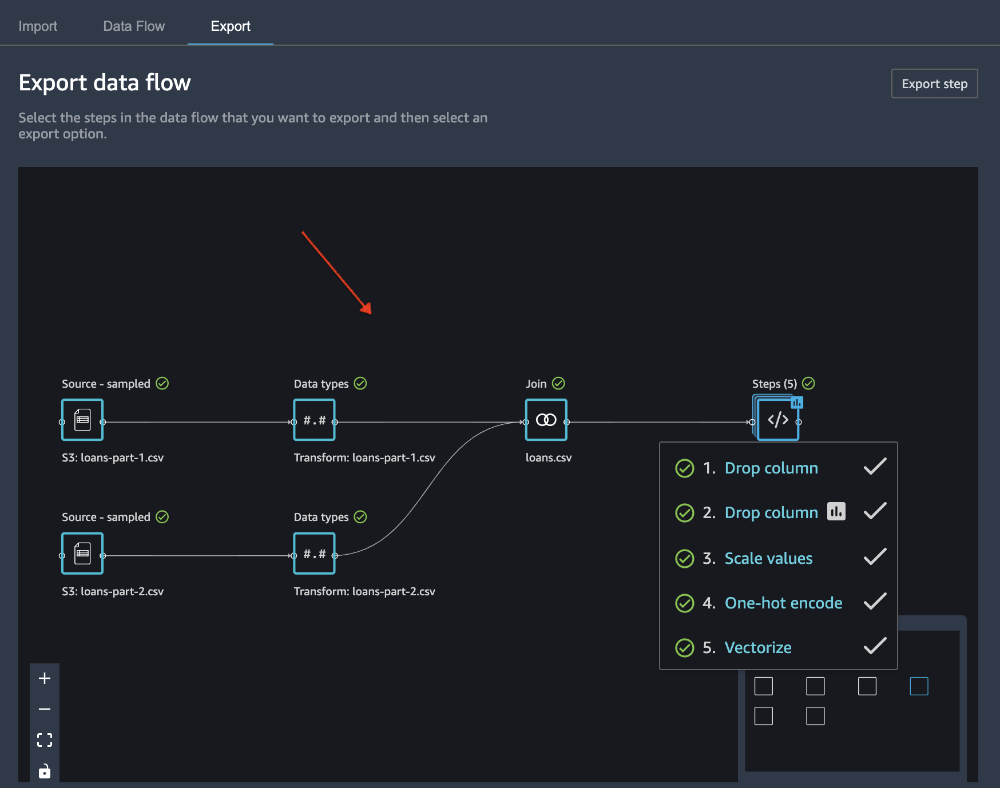
    * You can export the analysis and transforms in 4 different ways in addition to direct export to S3 which we saw previously.
        * Save to S3 as a SageMaker Processing job notebook.
        * Export as a SageMaker Pipeline notebook.
        * Export as a Python script.
        * Export to SageMaker Feature Store as a notebook.
    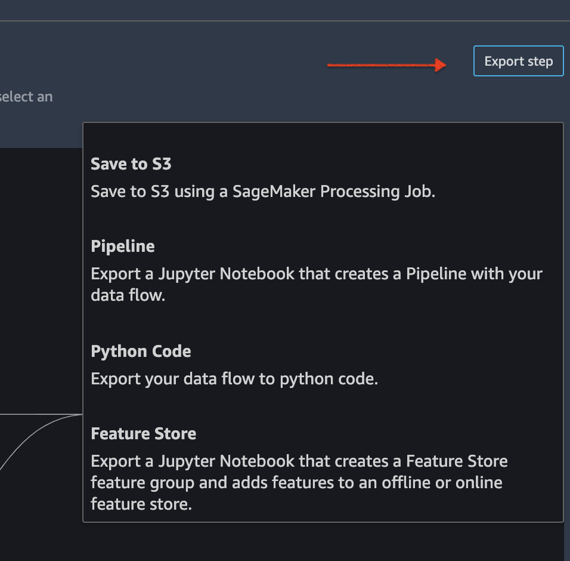
    * The exported notebooks are self contained in the repo at this [location](https://github.com/arunprsh/no-code-low-code/tree/main/finserv/tabular/loan-default-prediction).

## Demo 2: SageMaker Autopilot 

* **Creating an Autopilot Experiment**
    * SageMaker Autopilot automatically creates feature engineering pipelines, selects algorithms suitable for the machine learning problem type, trains and tunes several candidate models, before arriving at an optimal model.
    * Steps carried out by Autopilot are as follows:
        * *Automatic data pre-processing and feature engineering*
            * Automatically handles missing data.
            * Provides statistical insights about columns in your dataset.
            * Automatically extracts information from non-numeric columns, such as date and time information from timestamps.
            * Automatically handles imbalance in data.
            * Automatically creates 10 feature engineering (FE) pipelines most adapted to your problem. Those FE pipelines consist of FE transformations coming from both native Sklearn, and custom (https://github.com/aws/sagemaker-scikit-learn-extension) Sklearn-compatible FE transformations invented and open-sourced by Amazon. 
        * *Automatic ML model selection*
            * Automatically infers the type of predictions that best suit your data, such as binary classification, multi-class classification, or regression
            * Explores high-performing algorithms such as gradient boosting decision tree, feedforward deep neural networks, and logistic regression, and trains and optimizes hundreds of models based on these algorithms to find the model that best fits your data.
            * Automatically cross validates the data to flag problems like overfitting or selection bias and gives insights on how the model will generalize to an independent dataset.
        * *Automatic Model HPO*
            * Runs epsilon-greedy bandit tests for each of the FE pipelines, and progressively invests more HPO budget on the most rewarding FE pipeline.
        * *Model leaderboard*
            * Automatically ranks the candidate models based on user provided success metric such as accuracy, precision, recall, or area under the curve (AUC).
            * Lets user automatically deploy the model for real-time inference that is best suited to their use case.
        * *Explainability*
            * Automatic notebook generation showcasing the various candidates (pipelines) for feature engineering.
            * Automatic notebook generation for exploratory data analysis.
            * Uses SageMaker Clarify under the covers to provide model agnostic feature attribution metrics using SHAPley values.
        * *Automatic data and model provenance*
            * Uses SageMaker Experiments behind the scenes to automatically capture data and model lineage for each of the candidate models trained during the process.
    * To create an auto-pilot experiment, we will be using the transformed dataset that we saved in the final step of Demo 1 using Data Wrangler into S3.
    * First, from the studio launcher, click on the + button for *New Autopilot experiment*.
    * [Image: autopilot.png]
    * For the experiment settings, fill in the values as shown below in the following images.
    * [Image: Screen Shot 2021-09-03 at 7.24.01 PM.png]
    * [Image: Screen Shot 2021-09-03 at 7.25.36 PM.png]
    * You can tag an Autopilot experiment with key value pairs of information.
    * For input location, let us re-use the output location of the exported Data Wrangler dataset.
    * For output location of the autopilot experiment where autopilot will store the trained models and other artifacts, let us specify the same location as the input.
    * Set the Target column; in our case it is *loan_status*.
    * You can either set the problem type yourself (multi-class classification) or set it to *Auto* to let autopilot automatically identify the problem type based on the provided dataset.
    * Once we populate all the values, let us hit *Create Experiment* to kickoff the autopilot experiment.
    * Confirm that you want to deploy the best model as a SageMaker endpoint for real-time inference (shown below).
    * [Image: Screen Shot 2021-09-03 at 8.14.15 PM.png]
    * Once we launch the experiment, we are taken to a newer interface (as shown below) to show the status of the different phases of the autopilot experiment.
    * [Image: Screen Shot 2021-09-03 at 8.14.42 PM.png]
    * The experiment starts with the *Pre-processing* stage (shown below).
    * [Image: Screen Shot 2021-09-03 at 8.15.21 PM.png]
    * At this stage, autopilot kicks off a processing job for validating and split the dataset.
    * You can go to the SageMaker AWS console and under processing you can see this job.
    * [Image: Screen Shot 2021-09-04 at 12.20.17 PM.png]
    * You can also go to the CloudWatch logs of this processing job to get an high-level  understanding of what are the different steps that are being executed by Autopilot via this processing job.
    * To know more about SageMaker Processing jobs. Take a look at this resource (https://sagemaker.readthedocs.io/en/stable/amazon_sagemaker_processing.html).
    * [Image: Screen Shot 2021-09-04 at 12.29.41 PM.png]
    * Once the 1st processing job is complete, Autopilot enters the candidates generation stage, where it runs another processing job.
    * This processing job creates the different blueprints or recipes for the feature engineering as candidate pipelines.
    * [Image: Screen Shot 2021-09-04 at 12.28.51 PM.png]
    * The CloudWatch logs of the 2nd processing jobs shows Autopilot creating the different feature engineering candidate pipelines.
    * [Image: Screen Shot 2021-09-04 at 12.30.35 PM.png]
    * Once the candidates are generated, you can see two buttons enabled in the Autopilot experiment window. 
        * Open candidate generation notebook 
        * Open data exploration notebook
    * Both of these notebooks are included in the repo here (https://github.com/arunprsh/no-code-low-code/tree/main/finserv/tabular/loan-default-prediction).
    * In the next stage - *Feature Engineering*, Autopilot runs these feature engineering pipelines via SageMaker Training jobs.
    * [Image: Screen Shot 2021-09-04 at 12.30.50 PM.png]
    * Navigate to SageMaker console and under training, you should be able to see the 10 feature engineering pipelines that are being executed by Autopilot.
    * [Image: Screen Shot 2021-09-04 at 12.37.26 PM.png]
    * Once the feature engineering stage is completed. In the next stage - *Model* *Tuning*, Autopilot executes up to 250 training jobs. These jobs are created by combining a candidate feature engineering pipeline with a  selected algorithm and set of hyperparameters to tune.
    * See the candidate generation notebook in the repo to read through the feature engineering, algorithm selection and hyperparameter selection in detail.
    * [Image: Screen Shot 2021-09-04 at 1.34.33 PM.png]
    * In the SageMaker console, you can see the hyperparameter tuning job and the 250 training jobs that it kicks off.
    * [Image: Screen Shot 2021-09-04 at 2.01.51 PM.png]
    * [Image: Screen Shot 2021-09-04 at 1.43.10 PM.png]
    * Every SageMaker training job is tracked as an Autopilot trial and ranked as per the objective metric (in this case accuracy) which we selected at the start of the experiment. The best model is at shown at the top (see image below). At the end of the Model Tuning phase, we should be able to see all of the 250 training jobs that was run and the obtained metric value.
    * Once the Tuning stage is complete, the best model is deployed as a SageMaker endpoint. We enabled this option at the start when we defined the configs for the Autopilot experiment.
    * [Image: Screen Shot 2021-09-04 at 2.02.35 PM.png]
    * From the SageMaker console, you can see the deployed endpoint in service.
    * [Image: Screen Shot 2021-09-04 at 3.37.18 PM.png]
    * At the last stage, Autopilot generates explainability report generated via Amazon SageMaker Clarify (https://aws.amazon.com/sagemaker/clarify/), making it easier to understand and explain how the models make predictions. Explainability reports include feature importance values so you can understand how each attribute in your training data contributes to the predicted result as a percentage. The higher the percentage, the more strongly that feature impacts your model’s predictions. You can download the explainability report as a human readable file, view model properties including feature importance in SageMaker Studio, or access feature importance using the SageMaker Autopilot APIs (https://docs.aws.amazon.com/sagemaker/latest/dg/autopilot-reference.html).
    * [Image: Screen Shot 2021-09-04 at 2.08.40 PM.png]
    * After all the stages are completed, the UI looks as shown in the figure below.
    * [Image: Screen Shot 2021-09-04 at 2.23.15 PM.png]
    * You can also get to the previously run autopilot run experiments via the Experiments and trials option under SageMaker resources. Click on the triangle icon as pointed by the red arrow and choose Experiments and trials. 
    * Under experiments, choose the last run Autopilot experiment (pointed by the yellow arrow).
    * [Image: Screen Shot 2021-09-04 at 2.23.34 PM.png]
    * To get to the results of the best optimal model, right click on the best model and choose Open in model details as shown below.
    * [Image: best_model.png]
    * The results can be viewed in three tabs - Model explainability, Artifacts and Network. 
    * As you can see, XGBoost was the winning algorithm for the best model and the screenshot below shows model explainability (Feature Importance) results for the best model. Explainability results are only provided for the optimal model.
    * [Image: model-explain.png]
    * You can also view all the artifacts and where they are persisted under the Artifacts tab.
    * [Image: artifacts.png]
    * For models other than the best, you can view the following information. Note: explainability results are not shown for the secondary (non-winning) models.
    * [Image: other-models.png]
    * To get to the deployed endpoint details for the best model, Click on the SageMaker resources icon, choose Endpoints and pick the endpoint that was deployed.
    * [Image: ep.png]
* Online Inference (Real-time)
    * Code sample showing how to invoke the real-time endpoint for online inference with example payloads are contained here (https://github.com/arunprsh/no-code-low-code/blob/main/finserv/tabular/loan-default-prediction/real-time-inference.ipynb).
* Offline Inference (Batch)
    * Code sample showing how to kick off a SageMaker Batch Transform job for offline batch inference is contained in this notebook (https://github.com/arunprsh/no-code-low-code/blob/main/finserv/tabular/loan-default-prediction/batch-inference.ipynb).
    * To know more about SageMaker Batch Transform, click here (https://docs.aws.amazon.com/sagemaker/latest/dg/batch-transform.html).
* *Important pointers to note down:* 
    * You can also stop the Autopilot experiment after a certain number of trials (e.g. 20) instead of the default 250 max trials and still get results. By default, Autopilot tries to explore up to 250 trials with default settings. Suppose Autopilot starts consistently creating trials with an objective metric value greater than 0.90 accuracy (which is your desired goal) after the first 10 to 15 trials. You can click ‘Stop the experiment’ at this point for the purposes of this experiment.
    * For numeric feature columns, Autopilot doesn't interpret zeros as missing values and treats them as valid zero values. If they represent missing values then Autopilot should produce better results if you encode them as missing values by replacing them with an empty string. Generally, when using Autopilot, you should only impute missing values when you have some domain specific knowledge. It's usually better to leave missing values as missing values e.g., empty strings.
    * All operations (actions) performed in this demo via the SageMaker UI can be achieved using [SageMaker APIs](https://docs.aws.amazon.com/sagemaker/latest/dg/autopilot-reference.html).