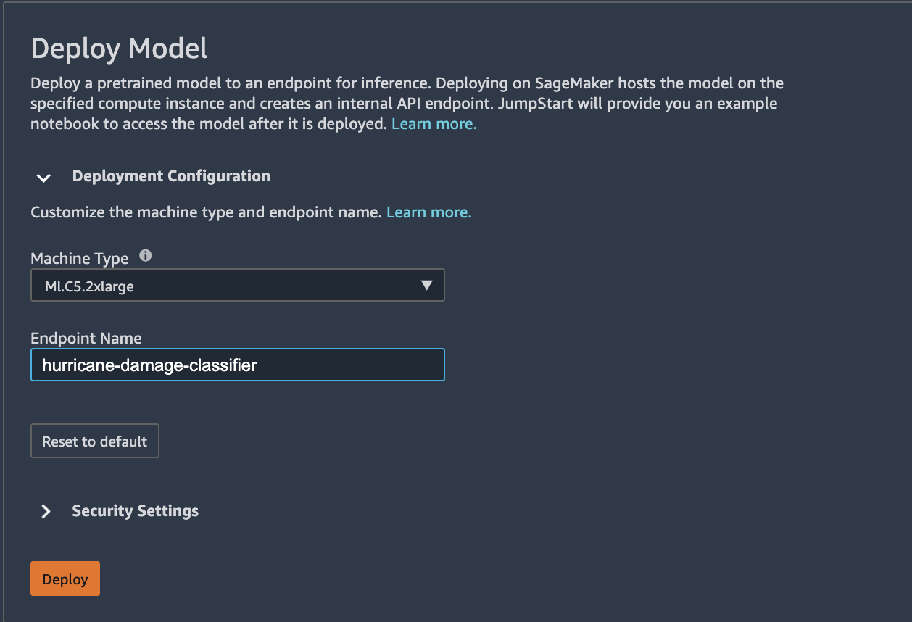
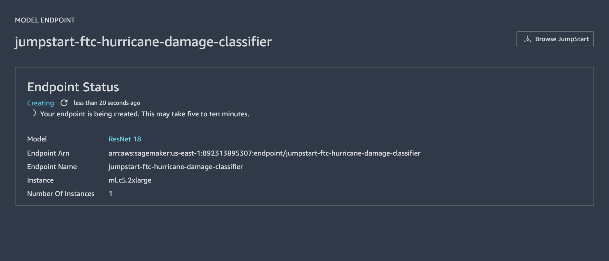
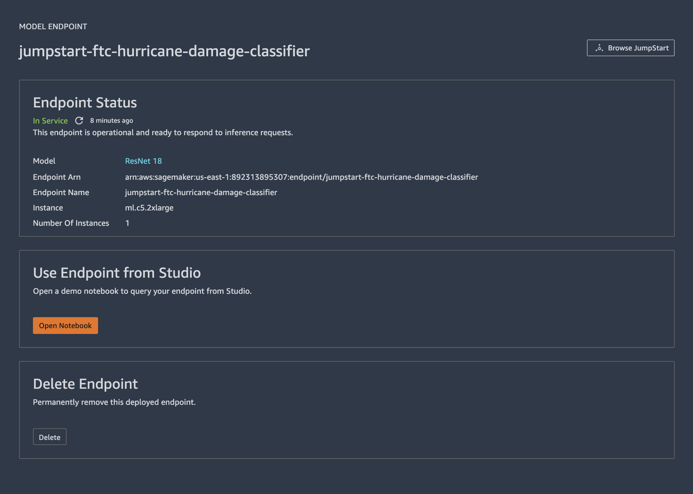

## Demo IV: SageMaker Jumpstart (Vision)

* **Use case: Detecting Damaged Buildings using Satellite Images of Hurricane Damage - Image classification (fine-tuned)**

   * For this demo, we will be using SageMaker Jumpstart to fine-tune a ResNet computer vision model for image classification to identify satellite images of roof tops for damage after a hurricane. 
    * The images below showcases roof tops that are damaged.
    
   * The images below showcases roof tops that are not damaged.
    
   * This data is self-contained in the workshop repo [here](https://github.com/arunprsh/no-code-low-code/tree/main/finserv/vision/hurricane-damage-classification).
    * Open the [explore-data.ipynb](https://github.com/arunprsh/no-code-low-code/blob/main/finserv/vision/hurricane-damage-classification/explore-data.ipynb) notebook to explore the data and copy the data from local to an S3 location.
    * To start with SageMaker Jumpstart, click on the Jumpstart icon on the left pane and click Browse Jumpstart as shown below.
    
   * In the Jumpstart UI, scroll to the Vision models and click View all as shown below.
    * Overall Jumpstart maintains a model zoo of over 200 neural network models for computer vision tailored for various downstream vision tasks like image classification, feature vectorization and object detection.
    
   * Now, you can see all the pre-trained models available for vision as displayed below.
    
    * Here, type ResNet and choose ResNet 18. This will be the network we will be using for our use case.
    
   * You can either use the ResNet 18 directly i.e., deploy the pre-trained model (ImageNet) as a SageMaker real-time endpoint or fine-tune the model using your own custom data.
    * The pre-trained models in Jumpstart can be fine-tuned to any given dataset comprising images belonging to any number of classes.
    * The model available for fine-tuning attaches a classification layer to the corresponding feature extractor model available on TensorFlow, and initializes the layer parameters to random values. The output dimension of the classification layer is determined based on the number of classes in the input data. 
    * The fine-tuning step fine-tunes the classification layer parameters while keeping the parameters of the feature extractor model frozen, and returns the fine-tuned model. The objective is to minimize prediction error on the input data. The model returned by fine-tuning can be further deployed for inference. 
    * Below are the instructions for how the training data should be formatted for input to the model.
        * Input: A directory with as many sub-directories as the number of classes.
            * Each sub-directory should have images belonging to that class in .jpg format.
        * Output: A trained model that can be deployed for inference.
            * A label mapping file is saved along with the trained model file on the s3 bucket
    * The images in the [data folder](https://github.com/arunprsh/no-code-low-code/tree/main/finserv/vision/hurricane-damage-classification/data) are already partitioned to be in the right format for fine-tuning. Run the explore-data notebook to copy the data from local to S3.
    
   * To fine-tune the model, choose the S3 location of the images we just uploaded using the explore-data notebook and specify the instance type we want to use for training.
    
   * For hyper-parameters, specify the number of epochs, learning rate and batch size for training.
    * You can modify the security settings if needed.
    
   * Hit Train and the training (fine-tuning) starts in a new view.
    
   * Once the training is done. You should see the view update as shown below.
    
   * Now to deploy the fine-tuned model, choose the appropriate instance type you want to use and hit Deploy.
    
   * The view changes to show the status of the endpoint creation.
    
   * Once the endpoint is created, you can Hit the Open Notebook to see example code for invoking the just created endpoint for image classification (real-time inference).
    * The workshop repo contains [make-inference.ipynb](https://github.com/arunprsh/no-code-low-code/blob/main/finserv/vision/hurricane-damage-classification/make-prediction.ipynb) notebook which is a working modified version of this example notebook which you can use to classify test images to validate the fine-tuned model.
    * *Note:* Make sure to update the name of the endpoint in the notebook to what you specify during model creation.
    
   * Tip: Ensure you specify the optimal set of hyperparameters during training (fine-tuning) to make sure your model is not overfitting on the dataset or one of the label.
    * You can also try other models for fine-tuning that support image classification.

