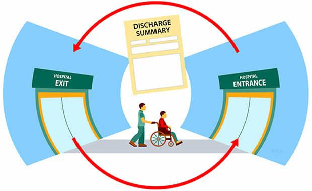

## Experimenting faster with No Code/Low Code ML tools from AWS

The Machine Learning (ML) journey requires continuous experimentation and rapid prototyping to be successful. In order to create highly accurate and performant models, data scientists have to first experiment with feature engineering, model selection and optimization techniques. These processes are traditionally time consuming and expensive. In this tech talk, data scientists will learn how the low-code / no-code capabilities found in **Amazon SageMaker Data Wrangler**, **Autopilot** and **Jumpstart**, make it easier to experiment faster and bring highly accurate models to production more quickly and efficiently.

* **What you will learn:**
    * Learn how to simplify the process of data preparation and feature engineering, and complete each step of the data preparation workflow.
    * Understand how to automatically build, train, and tune the best machine learning models based on your data, while allowing you to maintain full control and visibility.
    * Get started with ML easily and quickly using pre-built solutions for common use cases and open source models from popular model zoos.

## Representative Use Cases for Health Care and Life Sciences (HCLS) domain:
**Note:** If you are new to SageMaker Studio, instructions to get started with SageMaker Studio and setup this demo repository are provided [here](https://github.com/arunprsh/no-code-low-code/blob/main/setup-studio.md).

###  Demo I & II - Tabular (SageMaker DataWrangler + Autopilot)

* **Use case:** **Predict Diabetic Patients' Hospital Readmission**
    

    
     * Identify the factors that lead to the high readmission rate of diabetic patients within 30 days post discharge and correspondingly predict the high-risk diabetic-patients who are most likely to get readmitted within 30 days. 
    * Hospital readmission is an important contributor to total medical expenditures and is an emerging indicator of quality of care. Diabetes, similar to other chronic medical conditions, is associated with increased risk of hospital readmission. hospital readmission is a high-priority health care quality measure and target for cost reduction, particularly within 30 days of discharge. The burden of diabetes among hospitalized patients is substantial, growing, and costly, and readmissions contribute a significant portion of this burden. Reducing readmission rates among patients with diabetes has the potential to greatly reduce health care costs while simultaneously improving care.
    * It is estimated that 9.3% of the population in the United States have diabetes , 28% of which are undiagnosed. The 30-day readmission rate of diabetic patients is 14.4 to 22.7 % . Estimates of readmission rates beyond 30 days after hospital discharge are even higher, with over 26 % of diabetic patients being readmitted within 3 months and 30 % within 1 year. Costs associated with the hospitalization of diabetic patients in the USA were `$124` billion, of which an estimated `$25` billion was attributable to 30-day readmissions assuming a 20 % readmission rate. Therefore, reducing 30-day readmissions of patients with diabetes has the potential to greatly reduce healthcare costs while simultaneously improving care.

* **Dataset:** 
    * The data set represents 10 years (1999-2008) of clinical care at 130 US hospitals and integrated delivery networks. It includes over 15 features representing patient and hospital outcomes.
    * The data contains such attributes as race, gender, age, admission type, time in hospital, number of lab test performed, HbA1c test result, diagnosis, number of medication, diabetic medications, number of outpatient, inpatient, and emergency visits in the year before the hospitalization, etc.
    * The data set contains ~70,000 rows and 15 feature columns.

* **Experiment:**
    * SageMaker DataWrangler to perform exploratory data analysis (EDA) and feature engineering on the feature columns.
    * SageMaker Autopilot to train and tune an optimal multi-class classifier.

* **Step by step instructions:**
    * Step by step instructions to execute this demo is documented [here]().
    
### Demo III - Language (SageMaker Jumpstart)

* **Use case:** **Classify medical specialties based on transcription text**
    

    
    * The medical subdomain (specialty) of a clinical note, such as cardiology or neurology, is a useful content-derived metadata for developing machine learning downstream applications. Clinical notes, in which the medical reports are mainly written in natural language, have been regarded as a powerful resource to solve different clinical questions by providing detailed patient conditions, the thinking process of clinical reasoning, and clinical inference, which usually cannot be obtained from the other components of the electronic health record (EHR) system (e.g., claims data or laboratory examinations). 
    * Automated document classification is generally helpful in further processing clinical documents to extract these kinds of data. As such, the massive generation of clinical notes and rapidly increasing adoption of EHR systems has caused automated document classification to become an important research field of clinical predictive analytics, to help leverage the utility of narrative clinical notes. In this demo, we will using state-of-the-art transformer-based language models like **BERT** pre-trained on **MEDLINE/PubMed** data to design a custom specialty classifier for our use case.
    * In order to learn the custom knowledge instilled by our corpus (transcripts), we fine-tune the BERT model with our data specifically for the downstream task of classification.

* **Dataset:**
    * This dataset contains sample medical transcriptions for various medical specialties.

* **Experiment:**
    * SageMaker Jumpstart to train a multi-class classifier.
    * Use a pre-trained TensorFlow **BERT** pre-trained on **MEDLINE/PubMed** model directly on the provided dataset for classification.

* **Step by step instructions:**
    * Step by step instructions to execute this demo is documented [here](https://github.com/arunprsh/no-code-low-code/blob/main/hcls/language/README.md).

### Demo IV - Vision (SageMaker Jumpstart)

* **Use case:** **Mask Detection**
    

    
    * There are many solutions to prevent the spread of the COVID-19 virus and one of the most effective solutions is wearing a face mask. Almost everyone is wearing face masks at all times in public places during the coronavirus pandemic. This encourages us to explore face mask detection technology to monitor people wearing masks in public places. Most recent and advanced face mask detection approaches are designed using deep learning. In this demo, we will see how to use state-of-the-art object detection models from SageMaker Jumpstart like SSD MobileNet, EfficientNet, VGG16, ResNet etc. to fine-tune an object detection for our data set.
    
* **Dataset:**
    * [YOLO medical mask dataset](https://www.kaggle.com/gooogr/yolo-medical-mask-dataset). The data set comprises of 75 photos of people (130) with medical masks, labeled for odject detection. The annotations are converted from the original YOLO to bbox format in compliance with Jumpstart requirements.
    
* **Experiment:**
    * SageMaker Jumpstart to train an image classification model.
    * Fine-tune a pre-trained **SSD MobileNet 1.0** CV model on the provided dataset. This is an object detection model from Gluon CV. It takes an image as input and returns bounding boxes for the objects in the image.
    * The model is pre-trained on **COCO 2017** dataset which comprises images with multiple objects and the task is to identify the objects and their positions in the image. A list of the objects that the model can identify is given at the end of the page.
    
* **Step by step instructions:**
    * Step by step instructions to execute this demo is documented [here](https://github.com/arunprsh/no-code-low-code/blob/main/hcls/vision/README.md).