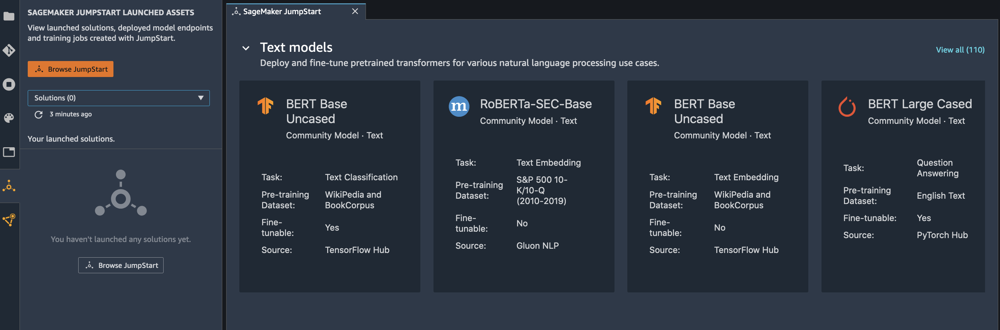
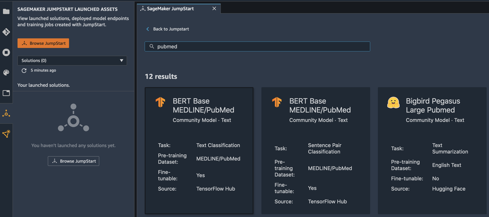
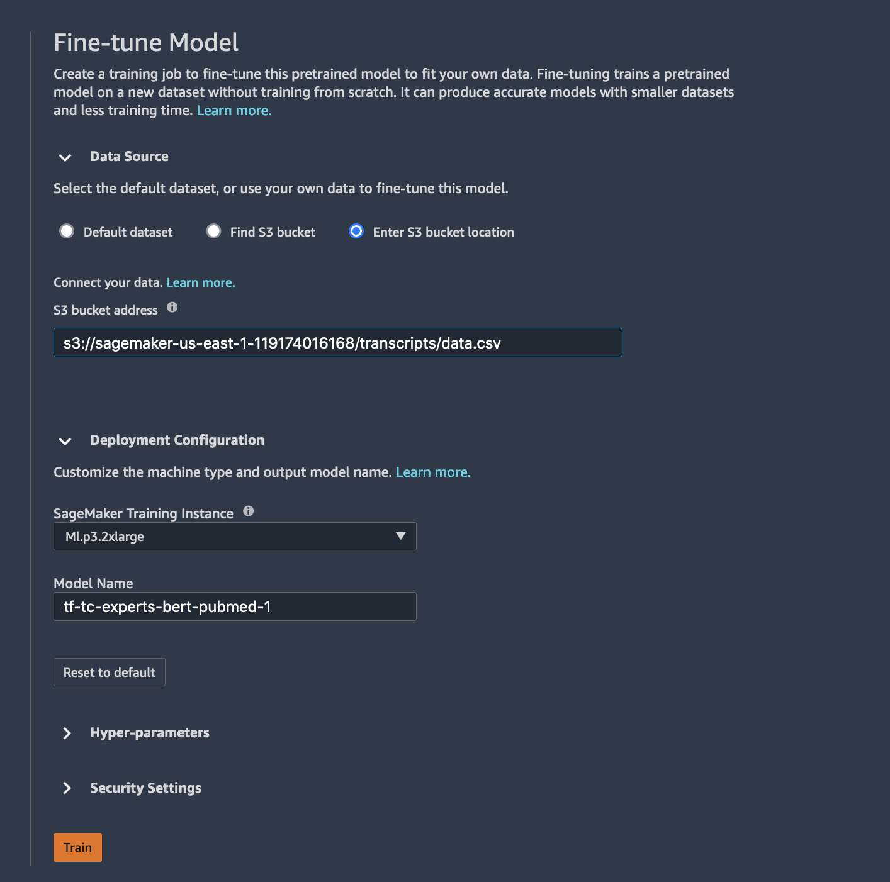

### Demo III - Language (SageMaker Jumpstart)

* **Use case:** **Classify medical specialties based on transcription text**
    

    
    * The medical subdomain (specialty) of a clinical note, such as cardiology or neurology, is a useful content-derived metadata for developing machine learning downstream applications. Clinical notes, in which the medical reports are mainly written in natural language, have been regarded as a powerful resource to solve different clinical questions by providing detailed patient conditions, the thinking process of clinical reasoning, and clinical inference, which usually cannot be obtained from the other components of the electronic health record (EHR) system (e.g., claims data or laboratory examinations). 
    * Automated document classification is generally helpful in further processing clinical documents to extract these kinds of data. As such, the massive generation of clinical notes and rapidly increasing adoption of EHR systems has caused automated document classification to become an important research field of clinical predictive analytics, to help leverage the utility of narrative clinical notes. In this demo, we will using state-of-the-art transformer-based language models like **BERT** pre-trained on **MEDLINE/PubMed** data to design a custom specialty classifier for our use case.
    * In order to learn the custom knowledge instilled by our corpus (transcripts), we fine-tune the BERT model with our data specifically for the downstream task of classification.

* **Dataset:**
    * This dataset contains sample medical transcriptions for various medical specialties.

* **Experiment:**
    * SageMaker Jumpstart to train a multi-class classifier.
    * Use a pre-trained TensorFlow **BERT** pre-trained on **MEDLINE/PubMed** model directly on the provided dataset for classification.

* **Step by step instructions:**
    * foo bar
        

        
    * foo bar
        

        
    * foo bar
        

        
    * foo bar
        

