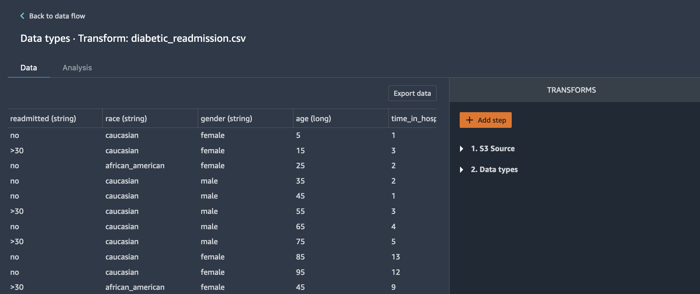

###  Demo I & II - Tabular (SageMaker DataWrangler + Autopilot)

* **Use case:** **Predict Diabetic Patients' Hospital Readmission**
    

    
     * Identify the factors that lead to the high readmission rate of diabetic patients within 30 days post discharge and correspondingly predict the high-risk diabetic-patients who are most likely to get readmitted within 30 days. 
    * Hospital readmission is an important contributor to total medical expenditures and is an emerging indicator of quality of care. Diabetes, similar to other chronic medical conditions, is associated with increased risk of hospital readmission. hospital readmission is a high-priority health care quality measure and target for cost reduction, particularly within 30 days of discharge. The burden of diabetes among hospitalized patients is substantial, growing, and costly, and readmissions contribute a significant portion of this burden. Reducing readmission rates among patients with diabetes has the potential to greatly reduce health care costs while simultaneously improving care.
    * It is estimated that 9.3% of the population in the United States have diabetes , 28% of which are undiagnosed. The 30-day readmission rate of diabetic patients is 14.4 to 22.7 % . Estimates of readmission rates beyond 30 days after hospital discharge are even higher, with over 26 % of diabetic patients being readmitted within 3 months and 30 % within 1 year. Costs associated with the hospitalization of diabetic patients in the USA were `$124` billion, of which an estimated `$25` billion was attributable to 30-day readmissions assuming a 20 % readmission rate. Therefore, reducing 30-day readmissions of patients with diabetes has the potential to greatly reduce healthcare costs while simultaneously improving care.

* **Dataset:** 
    * The data set represents 10 years (1999-2008) of clinical care at 130 US hospitals and integrated delivery networks. It includes over 15 features representing patient and hospital outcomes.
    * The data contains such attributes as race, gender, age, admission type, time in hospital, number of lab test performed, HbA1c test result, diagnosis, number of medication, diabetic medications, number of outpatient, inpatient, and emergency visits in the year before the hospitalization, etc.
    * The data set contains ~70,000 rows and 15 feature columns.
    
| **Column name**       | **Description**     | 
| :------------- | :---------- | 
|`Race Values`| Caucasian, Asian, African American or Hispanic|
|`Gender Values`| Male, Female, and Unknown/Invalid|
|`Age Grouped in 10-year intervals`|[0-10), [10-20), ..., [90-100)|
|`Time in hospital`|Integer number of days between admission and discharge|
|`Number of lab procedures`|Number of lab tests performed during the encounter|
|`Number of procedures`|Numeric Number of procedures (other than lab tests) performed during the encounter|
|`Number of medications`|Number of distinct generic names administered during the encounter|
|`Number of outpatient visits`|Number of outpatient visits of the patient in the year preceding the encounter|
|`Number of emergency visits`|Number of emergency visits of the patient in the year preceding the encounter|
|`Number of inpatient visits`|Number of inpatient visits of the patient in the year preceding the encounter|
|`Number of diagnoses`|Number of diagnoses entered to the system|
|`Glucose serum test result`|Indicates the range of the result or if the test was not taken. Values: ">200", ">300",  "normal" and "none" if not measured|
|`A1c test result`|Indicates the range of the result or if the test was not taken. Values: ">8" if the result was greater than 8%, ">7" if the result was greater than 7% but less than 8%, "normal" if the result was less than 7%, and "none" if not measured.|
|`Change of medications`|Indicates if there was a change in diabetic medications (either dosage or generic name). Values: "change" and "no change"|
|`Diabetes medications`|Indicates if there was any diabetic medication prescribed. Values: "yes" and "no" for 24 different kind of medical drugs.|
|`Readmitted`|Days to inpatient readmission. Values: "0" if the patient was readmitted in less than 30 days, ">30" if the patient was readmitted in more than 30 days, and "No" for no record of readmission|

* **Experiment:**
    * SageMaker DataWrangler to perform exploratory data analysis (EDA) and feature engineering on the feature columns.
    * SageMaker Autopilot to train and tune an optimal multi-class classifier.

* **Step by step instructions:**
    * **Data Wrangler**
        * Let's start with the *explore-data.ipynb* example notebook in this repo to take a look at our dataset and upload the data from local `data` folder to S3. With Data Wrangler, we are going to follow a 3-step approach for transforming our raw data columns into ML-ready feature columns. First, we start by performing some analyses prior to doing data transformations. We then follow by applying few data transformations and finally do more analysis on the transformed data to ensure we improved its quality. We validate this by comparing the results of analyses performed pre and post data transformations. Now, let us walkthrough each individual stage one by one.
        * Pre-transform Analysis
            * In this phase, we import the dataset from S3 and do 3 types of analysis. 1) Linear Feature Correlation, 2) Target Leakage and, 3) Quick Model.
            * From the Data Wrangler UI, select S3 as data source as shown below.
                

            
            * Navigate to your default bucket and choose `diabetic-readmission.csv` file.
                

                
            *  Foo Bar
                

                
            *  Foo Bar
                

            
            *  Foo Bar
                

            * foo bar 
                

            
            * foo bar 
                

            
            * foo bar 
                

            
            * foo bar 
                

            
            * foo bar 
                

            
            * foo bar 
                

            
            * foo bar 
                

            
            * foo bar 
                

            
            
        * Feature Transformations 
        
            * foo bar 
                

                
            * foo bar 
                

                
            * foo bar
                

                
            * foo bar
                

        
        * Post-transform Analysis 
            * foo bar 
            
    
    
    
    * Autopilot 
        
        * foo bar
            

            
        * foo bar
            

            
        * foo bar
            

            
        * foo bar
            

            
        * foo bar
            

            
        * foo bar
            

