###  Demo I & II - Tabular (SageMaker DataWrangler + Autopilot)

* **Use case:** **Predict Diabetic Patients' Hospital Readmission**
    

    
     * Identify the factors that lead to the high readmission rate of diabetic patients within 30 days post discharge and correspondingly predict the high-risk diabetic-patients who are most likely to get readmitted within 30 days. 
    * Hospital readmission is an important contributor to total medical expenditures and is an emerging indicator of quality of care. Diabetes, similar to other chronic medical conditions, is associated with increased risk of hospital readmission. hospital readmission is a high-priority health care quality measure and target for cost reduction, particularly within 30 days of discharge. The burden of diabetes among hospitalized patients is substantial, growing, and costly, and readmissions contribute a significant portion of this burden. Reducing readmission rates among patients with diabetes has the potential to greatly reduce health care costs while simultaneously improving care.
    * It is estimated that 9.3% of the population in the United States have diabetes , 28% of which are undiagnosed. The 30-day readmission rate of diabetic patients is 14.4 to 22.7 % . Estimates of readmission rates beyond 30 days after hospital discharge are even higher, with over 26 % of diabetic patients being readmitted within 3 months and 30 % within 1 year. Costs associated with the hospitalization of diabetic patients in the USA were `$124` billion, of which an estimated `$25` billion was attributable to 30-day readmissions assuming a 20 % readmission rate. Therefore, reducing 30-day readmissions of patients with diabetes has the potential to greatly reduce healthcare costs while simultaneously improving care.

* **Dataset:** 
    * The data set represents 10 years (1999-2008) of clinical care at 130 US hospitals and integrated delivery networks. It includes over 15 features representing patient and hospital outcomes.
    * The data contains such attributes as race, gender, age, admission type, time in hospital, number of lab test performed, HbA1c test result, diagnosis, number of medication, diabetic medications, number of outpatient, inpatient, and emergency visits in the year before the hospitalization, etc.
    * The data set contains ~70,000 rows and 15 feature columns.
    
| **Column name**       | **Description**     | 
| :------------- | :---------- | 
|`Race Values`| Caucasian, Asian, African American or Hispanic|
|`Gender Values`| Male, Female, and Unknown/Invalid|
|`Age Grouped in 10-year intervals`|[0-10), [10-20), ..., [90-100)|
|`Time in hospital`|Integer number of days between admission and discharge|
|`Number of lab procedures`|Number of lab tests performed during the encounter|
|`Number of procedures`|Numeric Number of procedures (other than lab tests) performed during the encounter|
|`Number of medications`|Number of distinct generic names administered during the encounter|
|`Number of outpatient visits`|Number of outpatient visits of the patient in the year preceding the encounter|
|`Number of emergency visits`|Number of emergency visits of the patient in the year preceding the encounter|
|`Number of inpatient visits`|Number of inpatient visits of the patient in the year preceding the encounter|
|`Number of diagnoses`|Number of diagnoses entered to the system|
|`Glucose serum test result`|Indicates the range of the result or if the test was not taken. Values: ">200", ">300",  "normal" and "none" if not measured|
|`A1c test result`|Indicates the range of the result or if the test was not taken. Values: ">8" if the result was greater than 8%, ">7" if the result was greater than 7% but less than 8%, "normal" if the result was less than 7%, and "none" if not measured.|
|`Change of medications`|Indicates if there was a change in diabetic medications (either dosage or generic name). Values: "change" and "no change"|
|`Diabetes medications`|Indicates if there was any diabetic medication prescribed. Values: "yes" and "no" for 24 different kind of medical drugs.|
|`Readmitted`|Days to inpatient readmission. Values: "0" if the patient was readmitted in less than 30 days, ">30" if the patient was readmitted in more than 30 days, and "No" for no record of readmission|

* **Experiment:**
    * SageMaker DataWrangler to perform exploratory data analysis (EDA) and feature engineering on the feature columns.
    * SageMaker Autopilot to train and tune an optimal multi-class classifier.

* **Step by step instructions:**
    * **Data Wrangler**
        * Let's start with the *explore-data.ipynb* example notebook in this repo to take a look at our dataset and upload the data from local `data` folder to S3. With Data Wrangler, we are going to follow a 3-step approach for transforming our raw data columns into ML-ready feature columns. First, we start by performing some analyses prior to doing data transformations. We then follow by applying few data transformations and finally do more analysis on the transformed data to ensure we improved its quality. We validate this by comparing the results of analyses performed pre and post data transformations. Now, let us walkthrough each individual stage one by one.
        * *Pre-transform Analysis*
            * In this phase, we import the dataset from S3 and do 3 types of analysis. 1) Linear Feature Correlation, 2) Target Leakage and, 3) Quick Model.
            * From the Data Wrangler UI, select S3 as data source as shown below.
                

            
            * Navigate to your default bucket and choose `diabetic-readmission.csv` file.
                

                
            *  Once you import the dataset, choose **Add analysis** to start performing analyses on the raw imported data.
                
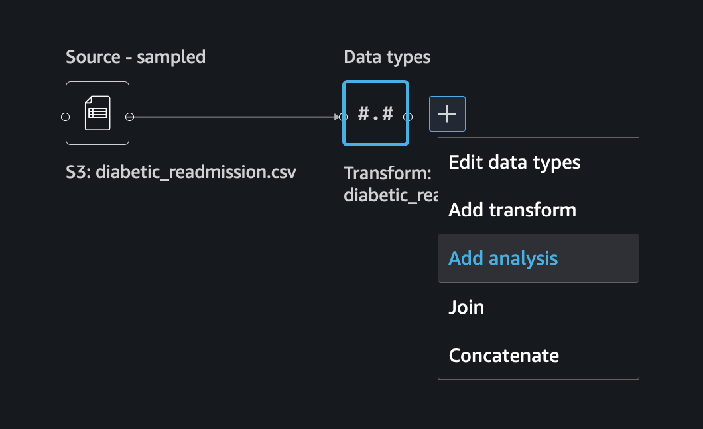

                
            *  As you can see from the screenshot below, Data Wrangler provides many options for exploratory data analysis and visualization. 
                
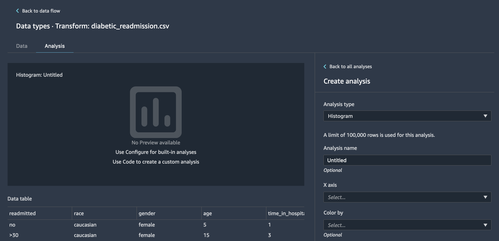

            
            * As a first analysis, we will be looking into the raw feature columns to analyse if there are any correlations (linear) amongst the features. You can either choose linear correlation to evaluate linear dependency (Pearson's correlation) between features or non-linear to evaluate more complex dependencies (Spearman's rank correlation and Cramer's V). For this exercise, let's choose linear.
                
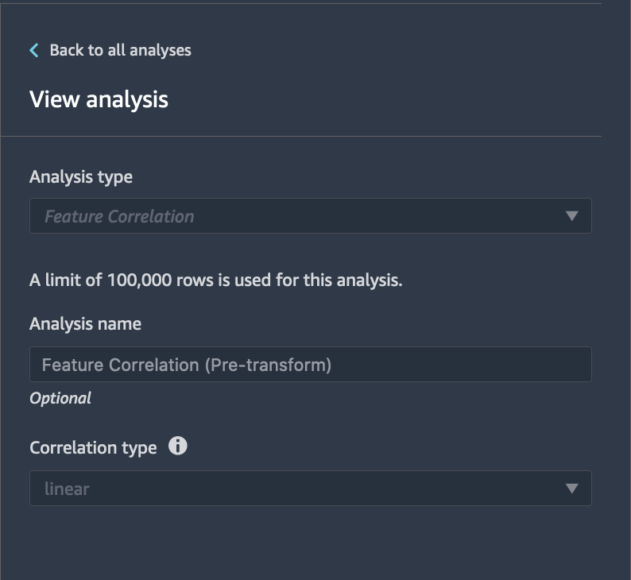

            
            * Once you hit the preview button, within a few minutes, you can see the results as per the image below, which breaks down the correlation between the raw features alongside Pearson's correlation score. 
                

            
            * You can also see the correlation matrix as a heatmap. This is automatically generated for you. Save the analysis.
                
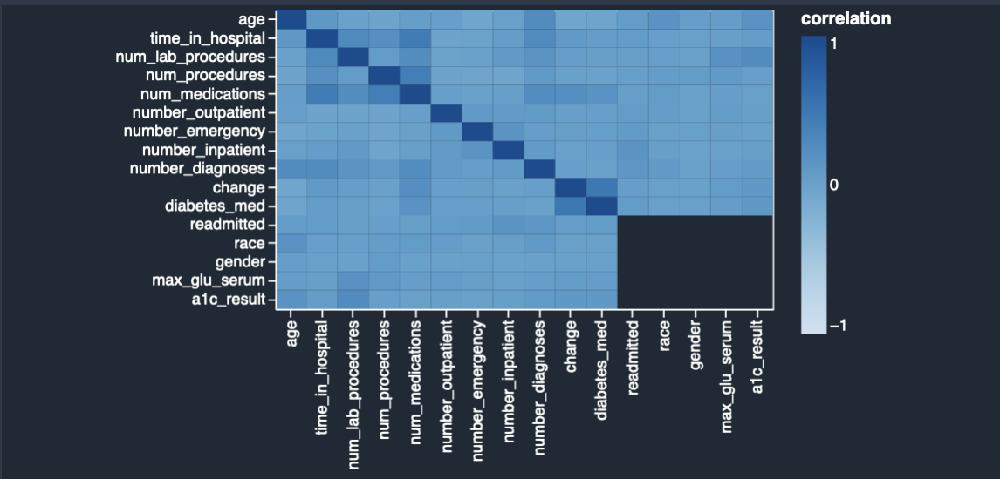

            
            * Next, we will create a Quick Model using the raw features. Use the Quick Model visualization to quickly evaluate your data and produce importance scores for each feature. A feature importance score indicates how useful a feature is at predicting a target label. The feature importance score is between [0, 1] and a higher number indicates that the feature is more important to the whole dataset. On the top of the quick model chart, there is a model score. A classification problem shows an F1 score. A regression problem has a mean squared error (MSE) score.  When you create a quick model chart, you select a dataset you want evaluated, and a target label against which you want feature importance to be compared. Data Wrangler does the following: 
            > Infers the data types for the target label and each feature in the dataset selected.  
            > Determines the problem type. Based on the number of distinct values in the label column, Data Wrangler determines if this is a regression or classification problem type. Data Wrangler sets a categorical threshold to 100. If there are more than 100 distinct values in the label column, Data Wrangler classifies it as a regression problem; otherwise, it is classified as a classification problem.  
            > Pre-process features and label data for training. The algorithm used requires encoding features to vector type and encoding labels to double type.  
            > Trains a random forest algorithm with 70% of data. Spark’s RandomForestRegressor is used to train a model for regression problems. The RandomForestClassifier is used to train a model for classification problems.  
            > Evaluates a random forest model with the remaining 30% of data. Data Wrangler evaluates classification models using an F1 score and evaluates regression models using an MSE score.  
            >Calculates feature importance for each feature using the Gini importance method. 
 
             
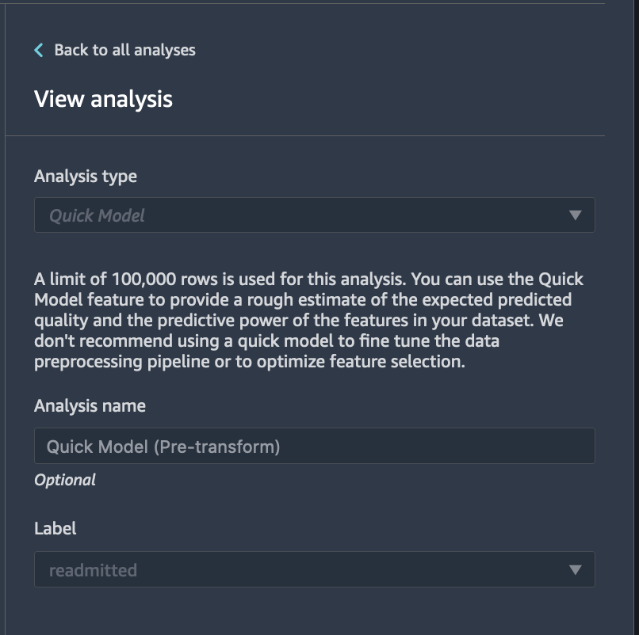

             
            * Screenshot of Quick Model's F1 Score.
                
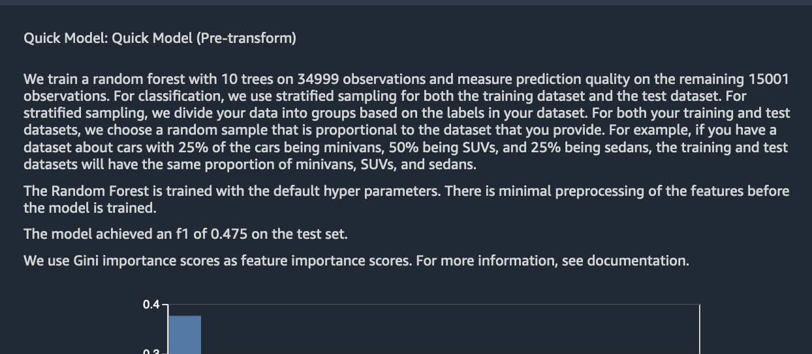

            
            * Screenshot of Quick Model's feature attribution scores.
                

            
            * The last analysis we will be doing is to look for target leakage in our data. Target leakage occurs when there is data in a machine learning training dataset that is strongly correlated with the target label, but is not available in real-world data. For example, you may have a column in your dataset that serves as a proxy for the column you want to predict with your model.  When you use the Target Leakage analysis, you specify the following: 

    > Target: This is the feature about which you want your ML model to be able to make predictions.  
    > Problem type: This is the ML problem type on which you are working. Problem type can either be classification or regression.  
    > (Optional) Max features: This is the maximum number of features to present in the visualization, which shows features ranked by their risk of being target leakage.  
    > For classification, the Target Leakage analysis uses the area under the receiver operating characteristic, or AUC - ROC curve for each column, up to Max features. For regression, it uses a coefficient of determination, or R2 metric.  
    > The AUC - ROC curve provides a predictive metric, computed individually for each column using cross-validation, on a sample of up to around 1000 rows. A score of 1 indicates perfect predictive abilities, which often indicates target leakage. A score of 0.5 or lower indicates that the information on the column could not provide, on its own, any useful information towards predicting the target. Although it can happen that a column is uninformative on its own but is useful in predicting the target when used in tandem with other features, a low score could indicate the feature is redundant. 
            

     

            
    *  You can see the results in the below screenshot showing the interpretation of the prediction ability of the columns. As per the results, the botton two columns - `max_glu_serum` and `a1c_result` are redundant columns.
    
        
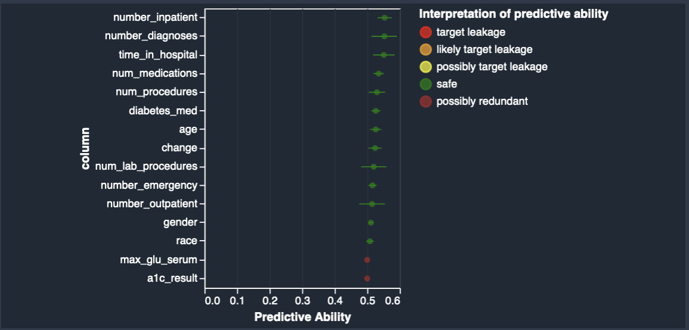

        
    * Once all your analyses are performed, you can go to the analysis dashboard to take a look at the previously saved analyses as show below.    
        

            
            
    * *Feature Transformations*
        Next, based on our initial exploratory analyses, lets apply some transformations to the raw features. 
        
        *  To apply data transformation, click on "Add transform" as shown below.
            
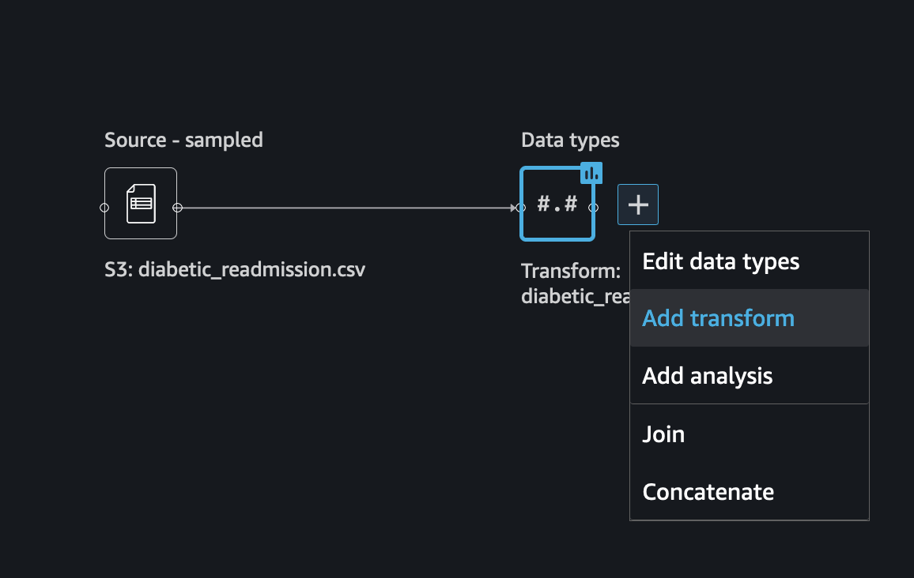

                
        *  From the Transforms interface, click "Add step". Data Wrangler provides 400+ transforms that you can choose. 
            

            
        * Lets drop all the redundant columns based on our previous analyses. First, lets drop the `max_glu_serum` column as shown in the screenshot below.
             
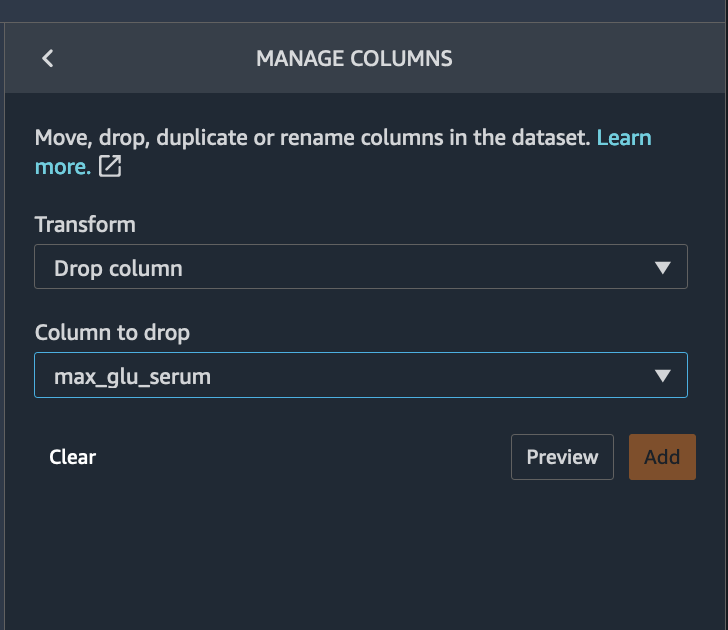

        
        * Similar to the above transform, lets also drop columns - `a1c_result`, `gender`, `num_procedures` and `num_outpatient`,
        * Next, lets one hot encode the `race` column using the encode categorical option as shown below.
            
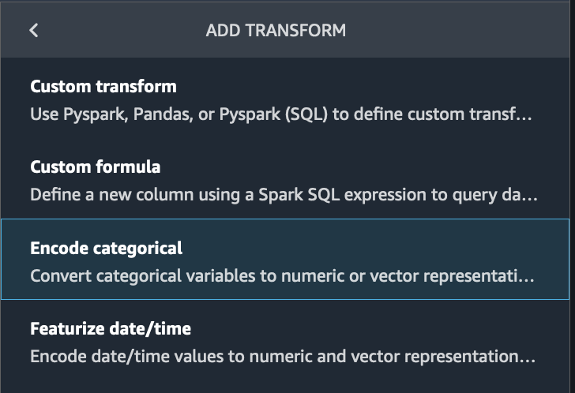

                
            
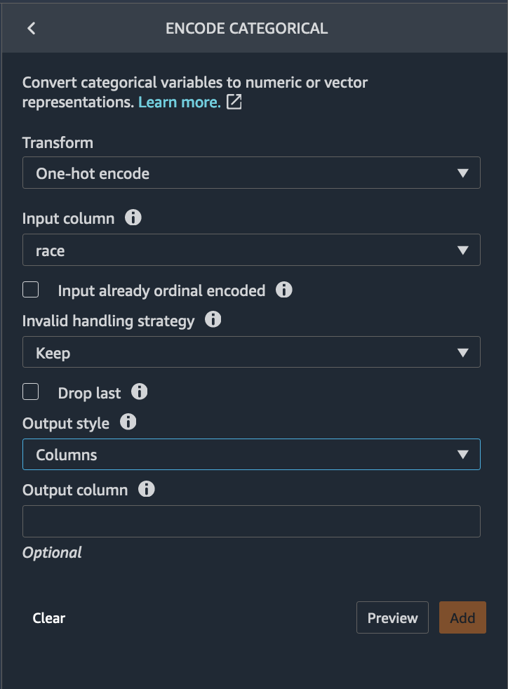

        
        * Next, click on **Back to data flow** to head back to the data flow interface. You can also export the output the transformed features so far directly into S3 by clicking on the **Export data** button.
            
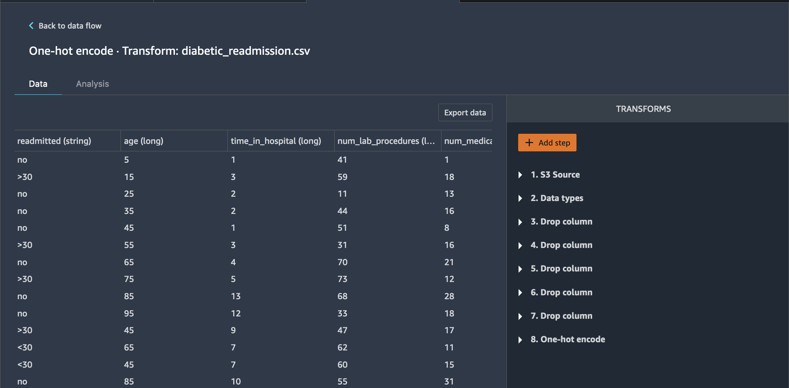

                
        * Click on the export tab and select all the transforms to be exported as shown below.
            

                
        * For exporting, choose one of the many options that are available.
            

        
    * *Post-transform Analysis*
        * For post-transform analysis, lets use the output of the previous stage where we performed a few transformations. By direct export, the output of the previous stage can be stored in S3. We can import this transformed features and build a Quick Model to see changes in feature attribution and most importantly validate if the transformations did really help with the predictions. 
        
        * Here, you can see both changes to feature attributions and improvement to the model prediction ability (increase in F-score) as shown in the screenshots below.
        
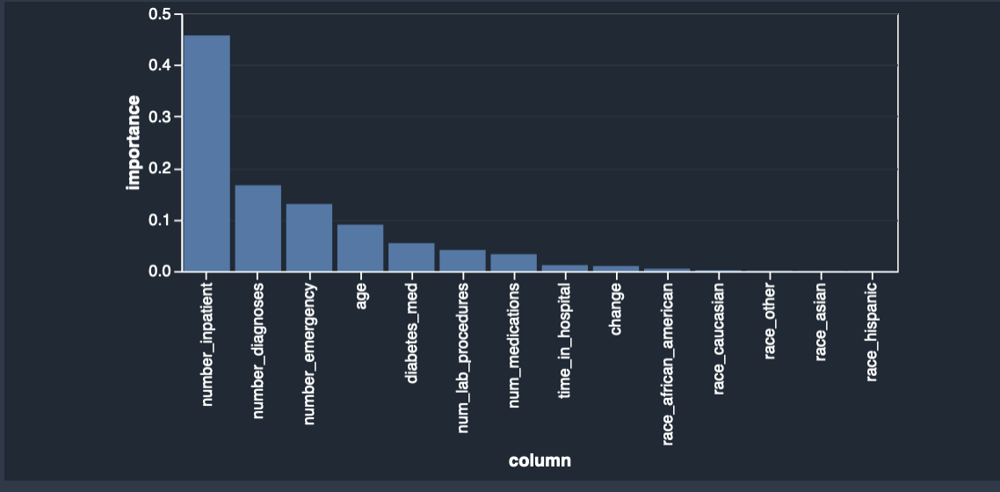

        
        
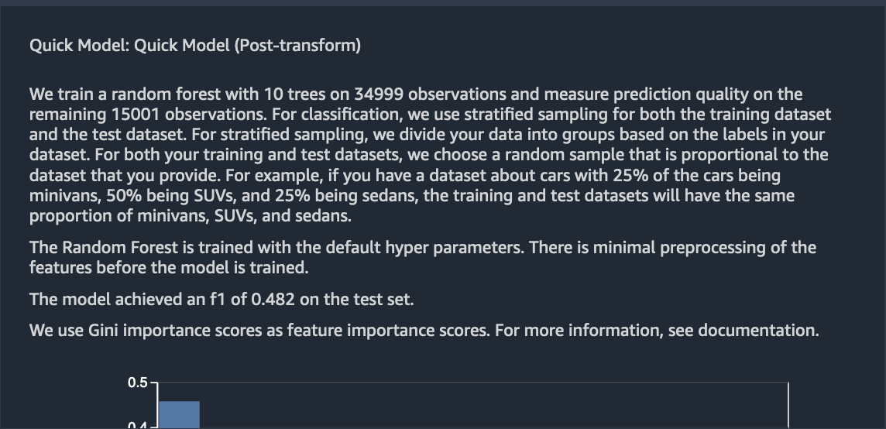

        * All the data flow files and generated notebooks by Data Wrangler can be found [here](https://github.com/arunprsh/no-code-low-code/tree/main/hcls/tabular/diabetic-readmission-prediction/data-wrangler).
    
    * **Autopilot**
        * For the Autopilot experiment, we will be using the transformed features exported via Data Wrangler to S3. From the Autopilot interface, specifiy the experiment settings as shown in the screenshots below and hit `Create Experiment`.
         

            
         
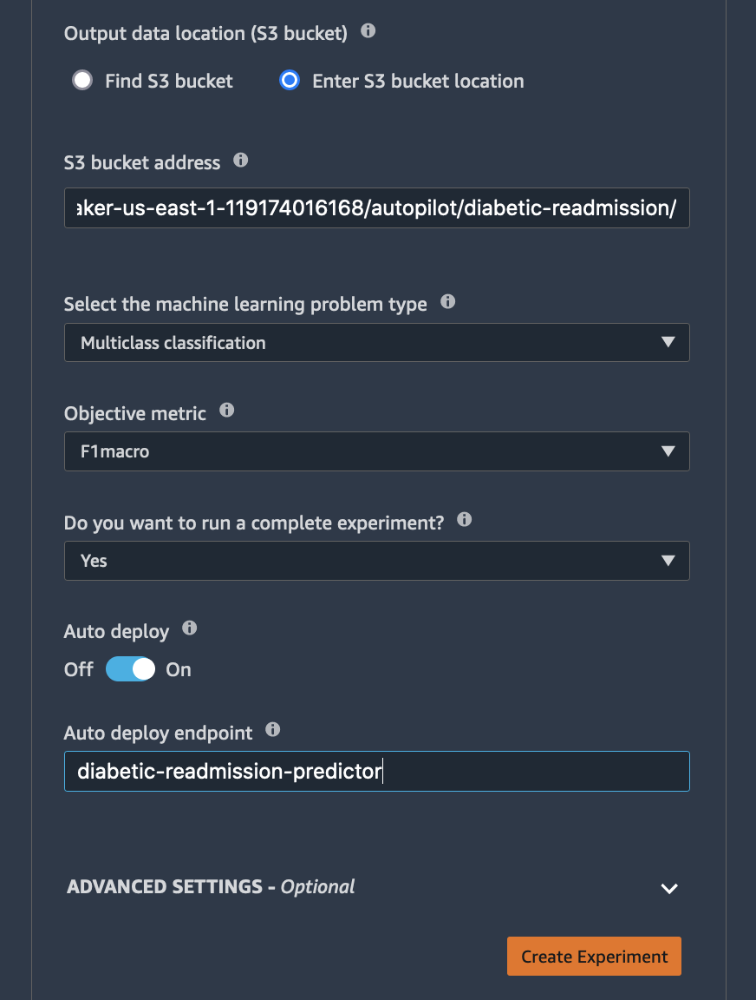

            
        * Once the Autopilot experiment starts, you will see it complete stages one by one starting with the pre-processing stage as shown below.
            

            
        * Once the candidate definitions (i.e., 10 feature engineering pipelines) are generated, you can see 2 buttons are enabled on the right upper corner of the workspace. These are links to generated notebooks showing the code for feature engineering and data exploration.
            
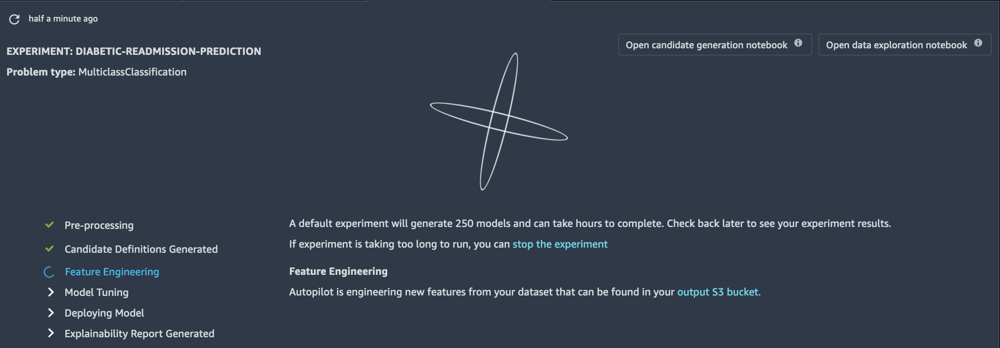

            
        * Once all the stages are completed, you can see ranked list of all the trained models by Autopilot along with the captured metrics.
            
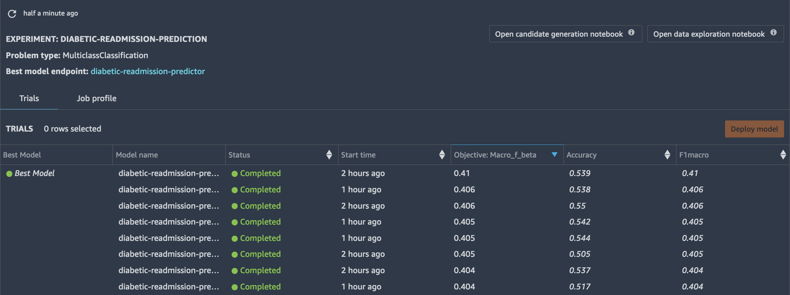

            
        * You can dive into the details of individual models by right clicking on the model and choosing `Open in model details`.
            

        * Once the experiment is completed, Autopilot will automatically deploy the best model as a real-time REST endpoint. 
        * The Autopilot generated candidate definitions and exploratory data analysis notebooks can be found [here](https://github.com/arunprsh/no-code-low-code/tree/main/hcls/tabular/diabetic-readmission-prediction/autopilot).